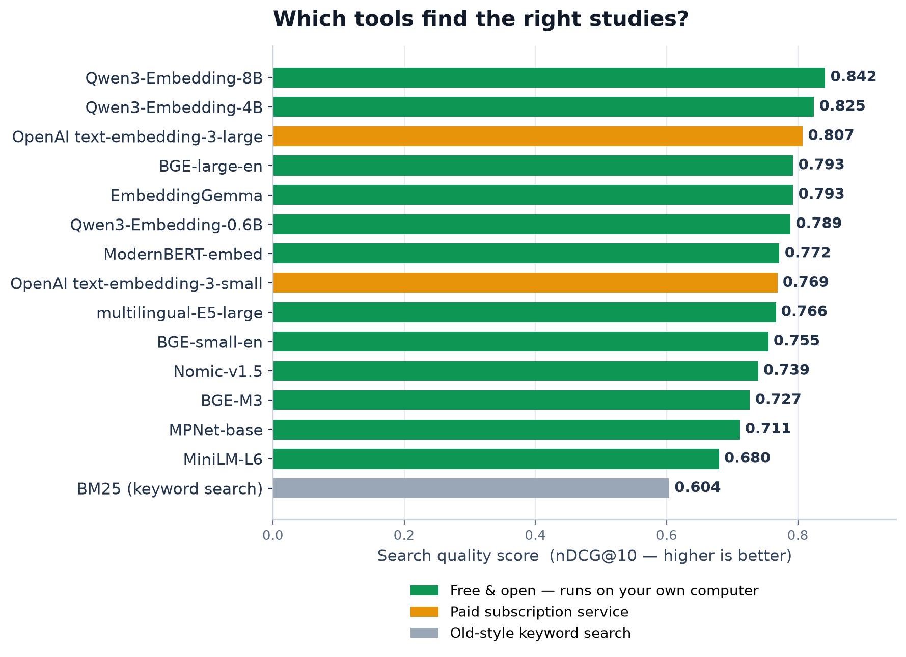
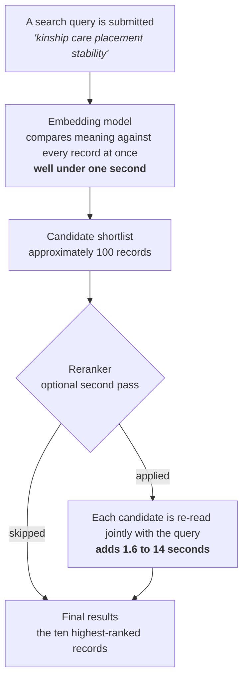

<div align="center">

# Searching the Social Work Literature by Meaning

**Benchmarking Free and Commercial Word Embedding Models and Rerankers for Retrieval over the Social Work Research Literature**

Brian E. Perron¹, Miao Wang²\*, Nanyi Deng³, Eunhye Ahn⁴

<sub>¹ School of Social Work, University of Michigan, Ann Arbor, MI, United States</sub><br>
<sub>² Department of Social Work and Social Policy, School of Sociology, Nankai University, Tianjin, China</sub><br>
<sub>³ Graduate School of Social Service, Fordham University, New York, NY, USA</sub><br>
<sub>⁴ School of Human Ecology, University of Wisconsin–Madison, Madison, WI, USA</sub><br>
<sub>\* Corresponding author</sub>

[](https://www.python.org/)
[](#privacy-and-data-handling)
[](LICENSE)
[](#results-at-a-glance)
[](data/metrics_leaderboard.csv)

</div>

---

## Abstract

Locating relevant studies is the first step of evidence-based practice, yet most literature search
still relies on exact keyword matching, so a query for *kinship care* can miss a study that only
says *relative caregivers*. This repository provides the full evaluation framework, test collection,
and results for a benchmark of **fourteen text-embedding models** (twelve free, open-weight; two
commercial OpenAI models) and **three cross-encoder rerankers**, evaluated on a **64,956-record**
window of the Social Work Research Database (SWRD v2, 1989–2025). Relevance was established through
a committee of two frontier-class AI judges making blind paired comparisons, aggregated with a
Bradley–Terry model, and independently corroborated by a judge-free known-item retrieval test and a
three-rater human validation study. The principal finding is that a free, open-weight model small
enough to run on an ordinary laptop matched or exceeded the paid commercial standard, and every
embedding model tested outperformed conventional keyword search.

---

## Results at a Glance

<div align="center">

</div>

- **Best overall configuration:** EmbeddingGemma with a reranker (nDCG@10 = **0.846**), exceeding every commercial model tested, on a model small enough to run on a laptop.
- **Free versus paid:** free models matched or exceeded both OpenAI embedding tiers; six free models outperformed the default paid tier alone.
- **Keyword search:** every one of the fourteen embedding models outperformed conventional keyword matching (BM25).

---

## Why Embedding Models Matter

An embedding model is not a generative system; it does not produce new text. It reads a passage and
converts its meaning into a numerical vector, so that two passages about the same idea are placed
close together even when they share no words in common. This single property has broad utility
across social work practice and research:

| Application | Description |
|---|---|
| **Evidence-based practice** | Locate studies that answer a practice question without enumerating every synonym an author might have used. |
| **Literature reviews** | Search a large body of research by topic and surface relevant work that keyword queries miss. |
| **Agency knowledge bases** | Search policies, program records, and practice guidance by meaning, entirely locally, so sensitive material never leaves the organization. |
| **Retrieval-augmented AI assistants** | Any system that answers from an organization's own documents depends on an embedding model to locate them first. |
| **Cost and infrastructure control** | The strongest results in this study came from free, open-weight models: no subscription, no vendor dependency, no external data transmission. |

---

## How Retrieval Works



A reranker is worth its added latency primarily when the underlying embedding model is weak; for a
strong model, the marginal gain is small. The complete model-by-reranker results are available in
[`data/metrics_leaderboard.csv`](data/metrics_leaderboard.csv).

---

## Key Terminology

| Term | Definition |
|---|---|
| **Embedding model** | Converts a document's title and abstract into a fixed-length numerical vector, positioning semantically similar documents near one another regardless of surface wording. Evaluates the full collection in a single pass. |
| **Reranker (cross-encoder)** | Jointly encodes the query and each shortlisted document to produce a refined relevance ordering. More discerning than an embedding model, but computationally too costly to apply to an entire collection. |
| **Open-weight model** | A model whose parameters are publicly available and executable on local hardware, without a subscription, per-query fee, or external data transmission. |
| **Retrieval versus generative AI** | Generative models produce new text; retrieval models locate existing documents. Embedding-based retrieval predates the current generative-AI era and underlies most modern search infrastructure. |
| **nDCG@10** | Normalized discounted cumulative gain at rank ten: a 0–1 measure of search quality that increases as the most relevant documents are ranked nearer the top of the first ten results. |

---

## Methodology Summary

1. **Topical search quality.** One hundred fifty curated queries, spanning realistic search-box
   phrases and natural-language questions, were evaluated against every model. Relevance was
   established by a committee of two frontier-class AI judges drawn from model families unrelated to
   any embedding model under evaluation, using blind paired comparisons rather than absolute scoring.
   Comparisons were aggregated with a Bradley–Terry model into per-document relevance scores, and
   summarized as nDCG@10.
2. **Known-item retrieval.** A second, fully automated and judge-free evaluation: for 496 records, an
   AI model produced a paraphrased description containing no distinctive original phrasing, and each
   embedding model was scored on its ability to relocate the source record across the full collection.
3. **Human validation.** Three expert raters independently completed an identical 120-pair
   stratified instrument, selecting the more relevant document in each pair or marking it as
   equivalent. This design yields both rater agreement with the AI committee and direct
   rater-to-rater concordance, establishing a human-agreement baseline against which committee
   reliability is assessed.

---

## Repository Structure

```
.
├── README.md
├── LICENSE
├── CITATION.cff
├── pyproject.toml
├── .env.example                    # template for your own Supabase / API settings
├── assets/
│   └── leaderboard.png              # the figure above, generated from data/metrics_leaderboard.csv
├── src/swrd_eval/                   # the evaluation pipeline (one module per stage)
├── config/
│   ├── models.yaml                  # embedding models and rerankers under evaluation
│   ├── eval.yaml                    # metrics, k-values, bootstrap settings
│   └── judge.yaml                   # query-generation and judging configuration
├── migrations/                      # database schema (Postgres / Supabase)
├── scripts/                         # analysis scripts used to produce the reported results
│   ├── pairwise_judge.py            #   frontier-committee paired-comparison judge
│   ├── evaluate_pairwise.py         #   Bradley–Terry aggregation and nDCG@10
│   ├── make_pairwise_review_v2.py   #   generates the human-validation instrument
│   ├── dedup_eval.py                #   corpus de-duplication
│   ├── ki_eval_final.py             #   known-item retrieval evaluation
│   ├── compare_judges.py            #   judge-agreement analysis
│   └── compare_judge_committees.py
├── tests/
└── data/
    ├── corpus_identifiers.csv       # record id, title, year, journal, source (no abstract text; see below)
    ├── queries_topical.csv          # the 150 curated topical queries
    ├── queries_known_item.csv       # the 496 known-item (paraphrase) queries
    ├── judgments_pairwise_frontier.csv  # all 50,328 paired relevance judgments
    ├── qrels_bradley_terry.csv      # Bradley–Terry relevance scores per query-document pair
    ├── metrics_leaderboard.csv      # final nDCG@10 leaderboard, all models and rerankers
    ├── metrics_known_item.csv       # final known-item Success@1/@10 by model
    └── human_validation/            # the three-rater validation instrument and completed ratings
```

### Data Availability

The evaluation corpus is a window of **SWRD v2** (1989–2025, de-duplicated, records with a non-empty
abstract), constructed from bibliographic metadata licensed from Web of Science, Scopus, and the
Directory of Open Access Journals; see Perron, Victor, and Qi (2026) for the full database
construction methodology. Because bulk redistribution of Web of Science and Scopus metadata is
restricted under their respective terms of service, `corpus_identifiers.csv` provides record
identifiers, titles, years, and sources, but not abstract text. This is sufficient to identify every
record used in the study and to retrieve abstract text independently under one's own licensing
terms. All data derived from this study, including the queries, every relevance judgment, the
human-validation materials, and all reported results, is released in full.

---

## Reproducing the Pipeline

```bash
# 1. Set up the environment (Python 3.12)
uv venv --python 3.12
uv pip install -e .

# 2. Configure your own data source (a Supabase project or equivalent corpus source)
cp .env.example .env

# 3. Run the pipeline stages
PYTHONPATH=src python -m swrd_eval.cli export     # retrieve the corpus
PYTHONPATH=src python -m swrd_eval.cli embed      # embed with each model
PYTHONPATH=src python -m swrd_eval.cli retrieve   # dense, BM25, and hybrid retrieval
PYTHONPATH=src python -m swrd_eval.cli rerank     # cross-encoder reranking
python scripts/pairwise_judge.py                  # frontier-committee judging
python scripts/evaluate_pairwise.py               # Bradley–Terry aggregation and nDCG@10
python scripts/ki_eval_final.py                   # known-item evaluation
```

Each stage is resumable and idempotent; see the module docstrings in `src/swrd_eval/` for
implementation detail. A CUDA-capable GPU is recommended for the larger embedding models; smaller
models run efficiently on CPU.

---

## Privacy and Data Handling

- **Local-first execution.** All embedding models and rerankers evaluated in this study run on local
  hardware, incurring no per-query cost and no dependency on an external vendor.
- **Judging.** The two frontier-class AI judges were accessed through a cloud inference service;
  only bibliographic metadata for already-published records (titles and abstracts) was transmitted.
- **Credentials.** Configuration secrets are read from a local `.env` file, which is never committed
  to version control (see `.env.example`).

---

## Use of Artificial Intelligence in This Project

AI assistants supported drafting, code development, and figure generation throughout this project.
Two open-weight AI models generated and curated the evaluation queries. Two frontier-class AI models,
accessed via a cloud inference service, produced the paired relevance judgments described above.
Three independent human experts validated a stratified sample of those judgments. All AI-assisted
output was reviewed by the authors, who take full responsibility for its accuracy and content.

---

## Citation

If this framework, test collection, or reported results are used in other work, please cite this
repository; see [`CITATION.cff`](CITATION.cff) for the current citation record, including the
in-review manuscript entry.

## License

Released under the [MIT License](LICENSE).

## Acknowledgments

This project builds on the open-source ecosystem for text embeddings and information-retrieval
evaluation, including `sentence-transformers`, `FlagEmbedding`, `bm25s`, and `ir-measures`.
