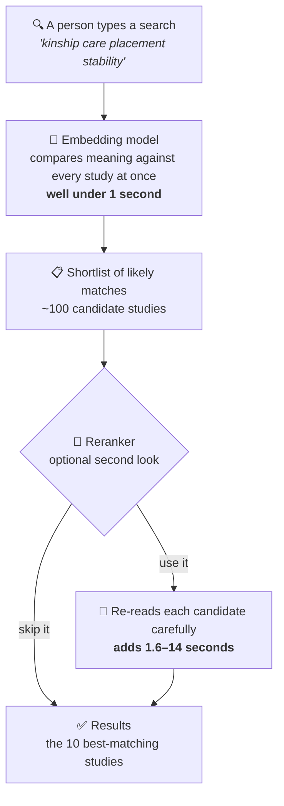

<div align="center">

# 🔎 Searching the Social Work Literature by Meaning

### Benchmarking free and commercial embedding models and rerankers for retrieval over the social work research literature

[](https://www.python.org/)
[](#-privacy--data)
[](LICENSE)
[](#-results-at-a-glance)
[](data/metrics_leaderboard.csv)

</div>

---

## 🧭 In one paragraph

Every year, more social work research is published than the year before, which makes it easier to
miss the study that matters. Most literature search still works by matching exact keywords, so a
search for **"kinship care"** can miss a study that only says **"relative caregivers."** An
**embedding model** fixes this by searching for *meaning* instead of exact words. This repository
benchmarks **14 embedding models** (12 free, 2 paid) and **3 rerankers** on **64,956 social work
research records**, and finds that a **free, tiny model running on an ordinary computer matched and
beat the paid commercial standard.**

---

## 📊 Results at a glance

<div align="center">

</div>

- 🏆 **Best overall:** EmbeddingGemma + a reranker (**0.846**) — beats every paid tool, on a model small enough for a laptop.
- 💸 **Free vs. paid:** free tools matched or beat both OpenAI tiers; six free models beat the everyday paid default.
- 🐢 **Keyword search lost, every time:** all 14 embedding models outscored plain keyword matching.

---

## 🧩 Why embeddings matter

An embedding model isn't a chatbot — it never writes anything. It reads text and turns its meaning
into numbers, so it can tell that two passages are "about the same thing" even when they don't share
a single word. That one capability is quietly useful across social work:

| | |
|---|---|
| 📚 **Evidence-based practice** | Find studies that answer a practice question without guessing every synonym an author might have used. |
| 🗂️ **Literature reviews** | Sweep a large body of research by topic and catch relevant work that keyword search misses. |
| 🏢 **Agency knowledge bases** | Search policies, program records, and practice guidance by meaning — locally, so nothing sensitive leaves the building. |
| 🤖 **Grounding AI assistants** | Any chatbot that answers from real documents relies on a tool like this to find them first. |
| 💰 **Cost and control** | The strongest results in this study came from free, open-weight models — no subscription, no vendor, no data leaving your machine. |

---

## ⚙️ How a search works



Rerankers are worth their added time mainly when the underlying embedding model is weak — for a
strong model, they add little. See [`data/metrics_leaderboard.csv`](data/metrics_leaderboard.csv) for
every model × reranker combination tested.

---

## 📖 Key terms, in plain language

| Term | What it means here |
|---|---|
| **Embedding model** (the *first-pass finder*) | Turns each study's title and abstract into a list of numbers — coordinates on a "map of meaning" — so similar ideas sit near each other even with different words. Fast; scans the whole collection at once. |
| **Reranker / cross-encoder** (the *careful second reader*) | Reads the search and each shortlisted study *together*, side by side, and re-orders the shortlist so the best answers rise to the top. Slower, but more discerning. |
| **Open-weight / local model** | A model whose internals are openly available and that runs on an ordinary computer — no subscription, no per-search fee, nothing sent to an outside company. |
| **Generative AI vs. retrieval AI** | Generative AI *writes* new text (chatbots). Retrieval AI *finds* existing documents. This project is about retrieval — an older technology that predates the chatbot era and quietly powers modern search. |
| **nDCG@10** | The headline search-quality score: 0–1, higher when the most relevant studies land nearest the top of the first ten results. |

---

## 🔬 How the evaluation works

1. **Topical search quality** — 150 curated queries (realistic search-box phrases and natural-language
   questions) were run against every model. Because no single AI judge should grade its own homework,
   relevance was scored by a **committee of two frontier-class AI judges from model families unrelated
   to every embedding model under test**, making **paired comparisons** (shown a query and two
   candidate papers, the judge picks the one that better answers it) rather than absolute 0–10 scores.
   Comparisons were aggregated with a **Bradley–Terry model** (the same method used to rate chess
   players) into per-paper relevance scores, then into nDCG@10.
2. **Known-item retrieval** — a second, fully automated, judge-free test: for 496 papers, an AI model
   wrote a paraphrased description (no distinctive phrases reused), and each embedding model was scored
   on whether it could relocate the original paper across the whole collection.
3. **Human validation** — three expert raters each independently completed an identical 120-pair
   instrument, stratified by how close the AI committee had scored each pair, choosing which paper
   better answered the query or marking it "about equal." This yields both per-rater agreement with
   the AI committee and direct rater-to-rater concordance — the human-to-human reference band against
   which committee-to-human agreement should be read.

Full methodological detail lives in the accompanying manuscript (in preparation).

---

## 📂 What's in this repository

```
.
├── README.md
├── LICENSE
├── CITATION.cff
├── pyproject.toml
├── .env.example                    # template for your own Supabase / API settings
├── assets/
│   └── leaderboard.png              # the chart above, generated from data/metrics_leaderboard.csv
├── src/swrd_eval/                   # the evaluation pipeline (one module per stage)
├── config/
│   ├── models.yaml                  # embedding models + rerankers under test
│   ├── eval.yaml                    # metrics, k-values, bootstrap settings
│   └── judge.yaml                   # query-generation and judging settings
├── migrations/                      # database schema (Postgres/Supabase)
├── scripts/                         # the analysis scripts used to produce the final results
│   ├── pairwise_judge.py            #   frontier-committee paired-comparison judge
│   ├── evaluate_pairwise.py         #   Bradley–Terry aggregation + nDCG@10
│   ├── make_pairwise_review_v2.py   #   generates the human-validation HTML instrument
│   ├── dedup_eval.py                #   corpus de-duplication
│   ├── ki_eval_final.py             #   known-item retrieval evaluation
│   ├── compare_judges.py            #   judge-agreement analysis
│   └── compare_judge_committees.py
├── tests/
└── data/
    ├── corpus_identifiers.csv       # record id, title, year, journal, source — NO abstract text (see Data note below)
    ├── queries_topical.csv          # the 150 curated topical queries
    ├── queries_known_item.csv       # the 496 known-item (paraphrase) queries
    ├── judgments_pairwise_frontier.csv  # all 50,328 paired relevance judgments
    ├── qrels_bradley_terry.csv      # Bradley–Terry relevance scores per (query, paper)
    ├── metrics_leaderboard.csv      # final nDCG@10 leaderboard, all models/rerankers
    ├── metrics_known_item.csv       # final known-item Success@1/@10 by model
    └── human_validation/            # the three-rater validation instrument + completed ratings
```

### A note on the corpus

The evaluation corpus is a window of **SWRD v2** (1989–2025, de-duplicated, abstract-bearing records
only) built from bibliographic metadata licensed from Web of Science, Scopus, and the Directory of
Open Access Journals — see Perron, Victor, & Qi (2026) for the full database construction
methodology. Because bulk redistribution of Web of Science / Scopus metadata is restricted under
their terms of service, **`corpus_identifiers.csv` ships record identifiers, titles, years, and
sources — not abstract text.** This is enough to identify exactly which papers were used and to
re-fetch abstract text from the original sources under your own license. Everything *derived* from
the corpus by this study (the queries, every relevance judgment, the human-validation ratings, and
all results) is released in full.

---

## 🚀 Reproducing the pipeline

```bash
# 1. Set up the environment (Python 3.12)
uv venv --python 3.12
uv pip install -e .

# 2. Add your own settings (a Supabase project or your own corpus source)
cp .env.example .env

# 3. Run the pipeline stages
PYTHONPATH=src python -m swrd_eval.cli export     # pull the corpus
PYTHONPATH=src python -m swrd_eval.cli embed      # embed with each model
PYTHONPATH=src python -m swrd_eval.cli retrieve   # dense + BM25 + hybrid retrieval
PYTHONPATH=src python -m swrd_eval.cli rerank     # cross-encoder reranking
python scripts/pairwise_judge.py                  # frontier-committee judging
python scripts/evaluate_pairwise.py               # Bradley–Terry + nDCG@10
python scripts/ki_eval_final.py                   # known-item evaluation
```

Each stage is resumable and idempotent — see the module docstrings in `src/swrd_eval/` for details.
A CUDA-capable GPU is recommended for the larger embedding models; smaller models run on CPU.

---

## 🔐 Privacy & data

- **Local-first.** The embedding models and rerankers run on your own machine — no per-search fees, no
  vendor lock-in.
- **Judging used a cloud inference service** (for the two frontier AI judges only); only bibliographic
  metadata (titles/abstracts of already-published papers) was ever transmitted, never anything
  sensitive.
- **Your own keys stay yours.** Configuration secrets live in a local `.env` file that is never
  committed (see `.env.example`).

---

## 🤖 How AI was used in this project

AI assistants supported drafting, editing, analysis code, and figure generation throughout. Two
open-weight AI models generated and curated the evaluation queries. Two frontier AI models, accessed
via a cloud inference service, produced the paired relevance judgments described above. Three human
experts independently validated a stratified sample of those judgments. All outputs were reviewed by
the authors, who take full responsibility for the work.

---

## 📚 Citation

If you use this framework, test collection, or results, please cite it — see [`CITATION.cff`](CITATION.cff).
A full citation to the accompanying paper will be added once it is published.

## ⚖️ License

Released under the [MIT License](LICENSE) — free to use, adapt, and build on, with attribution.

## 🙏 Acknowledgments

Built on the open-source ecosystem for text embeddings and information-retrieval evaluation, including
`sentence-transformers`, `FlagEmbedding`, `bm25s`, and `ir-measures`.
